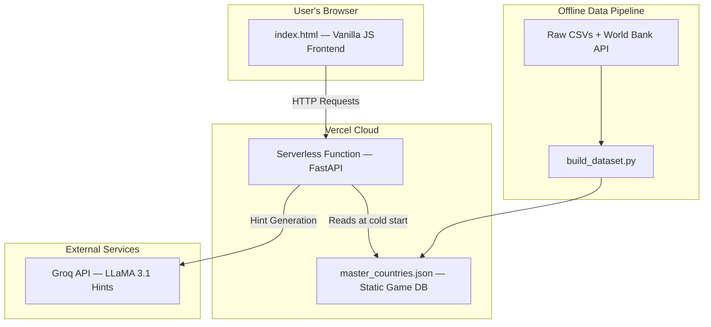

<div align="center">

# GEO-MATRIX

### _The Geographical Intelligence Grid_

[](https://www.python.org/)
[](https://fastapi.tiangolo.com/)
[](https://vercel.com/)
[](https://groq.com/)
[](#)

<br/>

> **A geography puzzle game where countries, categories, and clever thinking collide.**  
> Fill the 3×3 grid — each cell must satisfy both its row AND column criteria.

<br/>


<br/>

[](https://geogrid-two.vercel.app/)

[**Play Now →**](https://geogrid-two.vercel.app/) · [Architecture](#architecture) · [Setup](#installation--setup) · [Contributing](#contributing)

</div>

---

## What is Geo-Matrix?

Geo-Matrix is a **geography-based puzzle game** inspired by the format of sports grid games — but built entirely around countries, geopolitics, and culture. Each game presents a **3×3 grid** where every row and column carries a unique category:


Your job? Find a country for each cell that satisfies **both** its row and column. Simple to learn, endlessly deep.

---

## Features

| Feature | Description |
|---|---|
| **Dynamic Board Generation** | Every game is algorithmically crafted — guaranteed solvable and balanced in difficulty |
| **Autocomplete Search** | Instant country lookup with normalized fuzzy matching (handles accents, alternate names) |
| **Live Guess Validation** | O(1) set-intersection lookup — results returned in milliseconds |
| **AI-Powered Hints** | Stuck? Get a contextual clue generated by **Groq / LLaMA 3.1** — without spoiling the answer |
| **Rarity System** | Answers are scored as **Common → Rare → Epic → Mythic** based on country prominence |
| **Infinity Mode** | Endless replayability — boards never feel repetitive thanks to category cooldowns and semantic grouping |
| **Zero-Latency Data** | Game data is a pre-compiled static JSON — no database round-trips during gameplay |

---

## Tech Stack

```
┌─────────────────────────────────────────────────────────┐
│  Frontend      Vanilla HTML5 · CSS3 · JavaScript        │
│  Backend       Python 3.11 · FastAPI · Uvicorn          │
│  Deployment    Vercel (Serverless Functions + CDN)       │
│  Data Layer    Pandas ETL → Static JSON (Orjson)        │
│  AI / LLM      Groq API · LLaMA 3.1                     │
│  Tooling       python-dotenv · Unidecode                 │
└─────────────────────────────────────────────────────────┘
```

---

## Architecture

Geo-Matrix uses a **serverless, offline-first architecture** that separates the data pipeline from the live application entirely.



### How it Works

1. **Static Frontend** — `index.html` is served via Vercel's global CDN. All UI rendering and user interaction happen here in vanilla JS.
2. **Serverless API** — A FastAPI app runs as a Vercel Serverless Function, handling board generation, guess validation, search, and hint requests.
3. **Bundled Database** — `master_countries.json` is packaged directly with the serverless function. It loads once into memory at cold start — no database queries during gameplay.
4. **Offline Data Pipeline** — A separate set of Python scripts (run manually by the developer) ETL-processes raw CSVs and World Bank data into the optimized JSON database.

---

## Project Structure

```
Geogrid/
│
├── api/
│   ├── index.py              # FastAPI app — all API route definitions
│   └── game_logic.py         # Board generation, guess validation, search logic
│
├── data/
│   ├── raw/                  # Raw source CSVs (colony, FIFA, population, etc.)
│   └── processed/
│       └── master_countries.json   # The compiled game database
│
├── scripts/
│   ├── build_dataset.py      # ETL: merges raw data → master_countries.json
│   └── generate_rarity.py    # Assigns Common/Rare/Epic/Mythic via Groq API
│
├── index.html                # Complete single-page frontend application
├── vercel.json               # Vercel deployment + function configuration
├── requirements.txt          # Python dependencies
├── .python-version           # Pins Python 3.11 for Vercel builds
└── .env                      # Local secrets (not committed)
```

---

## Core Design Decisions

<details>
<summary><strong>Why pre-compute intersection counts?</strong></summary>

<br/>

At build time, `build_dataset.py` calculates how many valid countries exist for **every possible pair** of categories. This means at runtime, checking if a board cell is valid is a single dictionary lookup — **O(1)** — rather than an expensive set intersection. This makes board generation fast enough to try hundreds of combinations in milliseconds.

**Trade-off:** The build script takes longer to run, and data becomes stale when geopolitical facts change. But for this scale, the runtime benefit far outweighs the build-time cost.

</details>

<details>
<summary><strong>Why a JSON file instead of a database?</strong></summary>

<br/>

The game data is **read-only** — no writes ever happen at runtime. A traditional database (PostgreSQL, MongoDB) would add cost, network latency, and operational complexity for zero benefit. A static JSON file loaded into memory is orders of magnitude faster and completely free to run.

</details>

<details>
<summary><strong>How do AI hints avoid spoiling the answer?</strong></summary>

<br/>

The hint endpoint picks a random valid country for the cell, then sends it to the Groq API with an explicit prompt instruction: **do not mention the country's name in your response**. The LLM generates a geographical, historical, or cultural clue around the answer — useful, but not a giveaway.

</details>

---

## Installation / Setup

### Prerequisites

- **Python 3.11+**
- A **Groq API key** — get one free at [console.groq.com](https://console.groq.com)

### 1. Clone the repository

```sh
git clone https://github.com/your-username/Geogrid.git
cd Geogrid
```

### 2. Create and activate a virtual environment

```sh
# macOS / Linux
python3 -m venv venv
source venv/bin/activate

# Windows
python -m venv venv
.\venv\Scripts\activate
```

### 3. Install dependencies

```sh
pip install -r requirements.txt
```

### 4. Configure environment variables

Create a `.env` file in the project root:

```env
GROQ_API_KEY="gsk_your_key_here"
```

---

## How to Run

### Start the backend API

```sh
uvicorn api.index:app --reload
```

The API will be available at `http://127.0.0.1:8000`.

### Start the frontend

Open `index.html` directly in your browser, or use the **VS Code Live Server** extension for a better experience. The frontend auto-connects to your local API.

> **Tip:** The `master_countries.json` is already included in the repo — you don't need to run the build scripts to play.

---

## How to Play

```
1.  Click "⟳ New Mission"  →  A fresh board is generated
2.  Click any cell          →  Opens the country search modal
3.  Type a country name     →  Autocomplete suggests matches
4.  Click a result          →  Guess is submitted and validated instantly
5.  Click "?"               →  Get an AI hint without revealing the answer
```

Each cell can only be used once. Try to fill all 9 cells!

---

## Known Limitations

- **Stateless Cooldowns** — The category cooldown (preventing repeated categories across games) uses an in-memory list. Since Vercel serverless functions are stateless, this resets on every cold start and won't work reliably in production across multiple users.
- **Static Game Data** — `master_countries.json` reflects the world as of the last data build. Geopolitical changes require a manual rebuild and redeploy.

---

## Roadmap

- [ ] **Persistent Session State** — Replace in-memory cooldown with Vercel KV or Redis
- [ ] **Automated Data Pipeline** — GitHub Action to rebuild the dataset on a weekly schedule
- [ ] **User Accounts & Leaderboards** — Track scores and compete with others
- [ ] **Frontend Refactor** — Break `index.html` JS into ES Modules (`api.js`, `ui.js`, `game.js`)
- [ ] **Input Validation** — Add Pydantic guards on category inputs to return proper 400 errors
- [ ] **Daily Challenge Mode** — A shared board that resets every 24 hours

---

## Contributing

Contributions are welcome! If you have ideas for new categories, bug fixes, or feature improvements:

1. **Fork** the repository
2. **Create** your feature branch: `git checkout -b feature/your-feature`
3. **Commit** your changes: `git commit -m 'Add some feature'`
4. **Push** to the branch: `git push origin feature/your-feature`
5. **Open** a Pull Request

For major changes, please open an issue first to discuss what you'd like to change.

---

## License

This project is currently unlicensed. All rights reserved by the author.

---

<div align="center">

Built with and a deep love for geography.

</div>